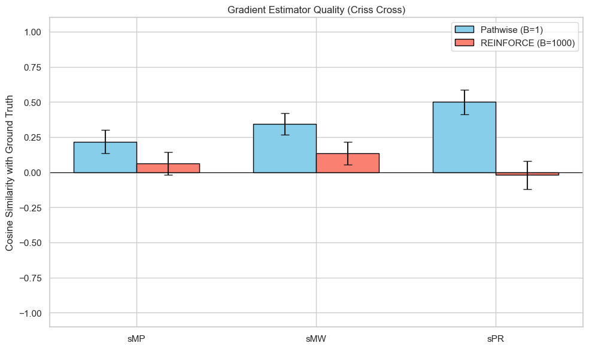
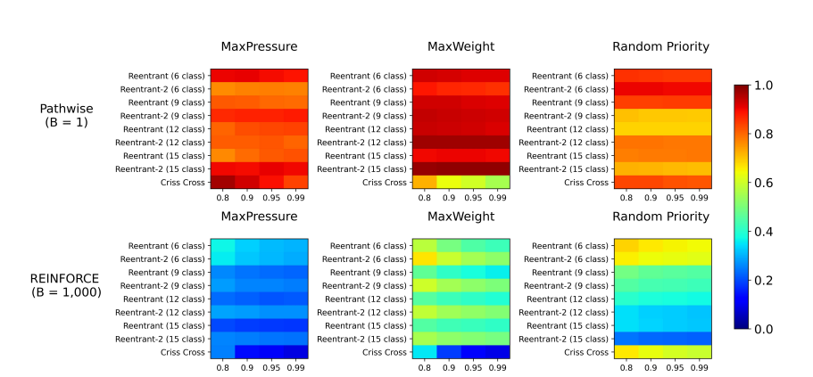
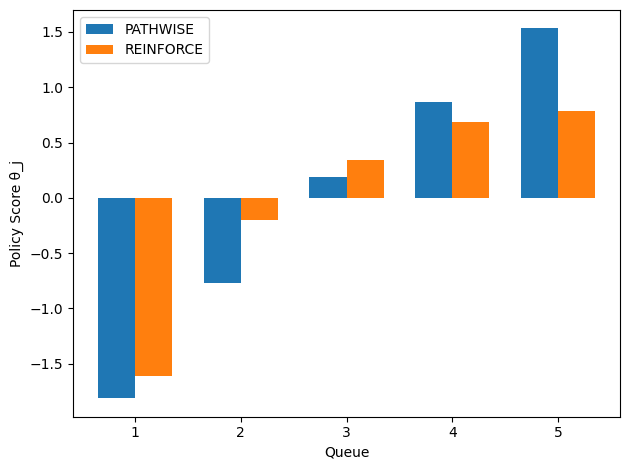
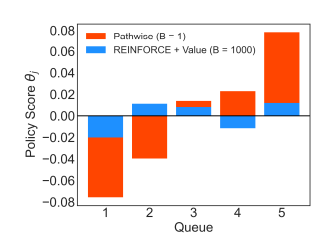
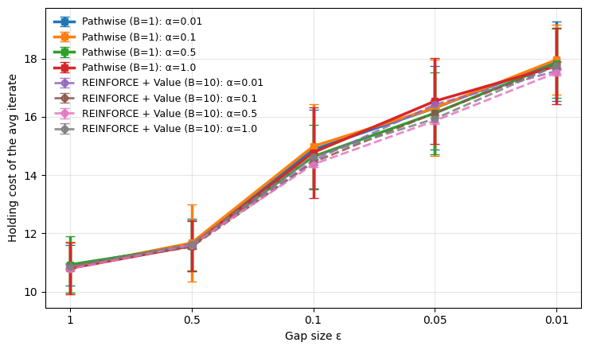
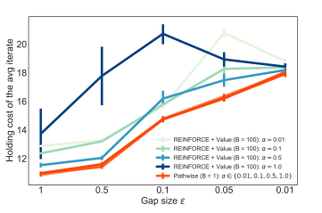
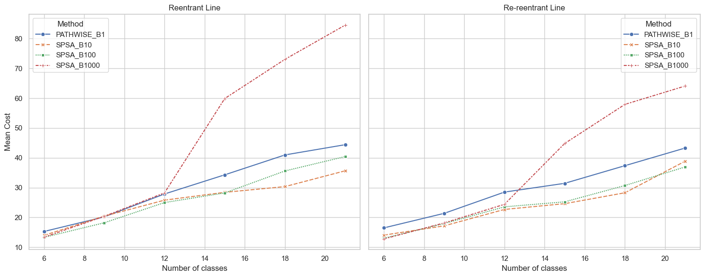
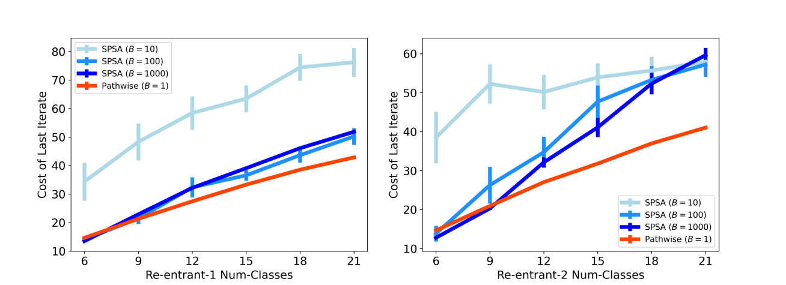

# Validation of Pathwise Estimators in DDES Gradient Analysis
Overall, the results validate the paper's main conclusions: the PATHWISE estimator offers better estimation quality and scalability than REINFORCE or SPSA, although the absolute values sometimes differ.
## Section 5.1

- Comparison
  - Trend: The results faithfully reproduce the performance hierarchy of the paper. The PATHWISE estimator (blue) consistently achieves higher cosine similarity with the "true" gradient than REINFORCE (red/orange) across all three policies (sMP, sMW, sPR).
  - Magnitude: There is a notable difference in absolute values.
  - Paper: PATHWISE reaches a similarity close to 1.0 (perfection) and REINFORCE between 0 and 0.3.
  - The result: PATHWISE peaks around 0.50 (for sPR) and REINFORCE is close to 0 or 0.15.

## Section 5.2

- Left Panel (Bars - Scores $\theta_j$):
  - Reproduction: Excellent. The figure figure_9_1.png shows that PATHWISE assigns strictly increasing scores (from -1.8 to +1.5) corresponding to the queue indices (1 to 5).
  - Analysis: This confirms the paper's result that PATHWISE allows learning the correct priority order (the $c\mu$ rule) with a single trajectory ($B=1$), whereas REINFORCE ($B=100$ in the paper, or the orange bar) fails to establish a strict and coherent order.
- Right Panel (Curves - Cost vs. Gap):
  - Context: The figure figure_9_2.png differs slightly from Figure 9 (right) in the paper. The paper plots cost against learning rate (step size), whereas you plot cost against the gap size ($\epsilon$).
  - Analysis: The results show that for harder tasks (small $\epsilon$, e.g., 0.01), costs increase, which is logical. The paper notes that PATHWISE is more robust to hyperparameters. The curves show that PATHWISE (solid lines) remains competitive and stable, validating its ability to optimize even when service differences ($\epsilon$) are minimal.

## Section 5.3

Overall, the experiment validates the paper’s primary hypothesis: that standard finite-difference methods (SPSA) scale poorly with problem dimension compared to the PATHWISE estimator. However, the results regarding low-sample SPSA differ interestingly from the paper's specific observations.
1. The "Collapse" of High-Sample SPSA (Strong Validation)

The most significant finding in the reproduction matches the paper's most critical claim: simply adding more data to a zeroth-order method (SPSA) does not solve the dimensionality problem.
- The Paper Claims: "Even with B=1000 trajectories, SPSA is unable to effectively optimize the buffer sizes for larger networks". The paper argues that performance scales poorly with problem dimension.
- The Results: This is perfectly reproduced. In the JSON data for the largest network (reentrant_7.yaml, 21 classes), SPSA_B1000 explodes to a mean cost of 84.55.
- Comparison: In contrast, PATHWISE_B1 maintains a much lower cost of 44.42. This confirms that in high-dimensional spaces (21 buffers to tune), the brute-force approach of using 1000 trajectories per step fails to find a descent direction effectively, whereas the gradient-based PATHWISE succeeds with 1000x less data.
2. PATHWISE vs. SPSA Efficiency
- The Paper Claims: "PATHWISE with only a single trajectory is able to outperform SPSA with B=1000 trajectories for larger networks".
- The Results: Confirmed.
  - In the Re-reentrant line (Right Panel, 21 classes), PATHWISE (B=1) has a cost of 43.30, while SPSA (B=1000) has a cost of 64.10.
  - Visually, in the figure_11.png, the blue line (PATHWISE) is consistently and significantly below the red dashed line (SPSA B=1000) for all networks larger than 12 classes.
3. The Divergence: SPSA B=10 Stability

There is a notable difference between the results and the paper regarding the performance of SPSA with small batch sizes (B=10).
- The Paper Claims: SPSA with B=10 is "much less stable," leading to "much higher costs" because it often sets buffer sizes to zero, failing to stabilize the queue. In the paper's Figure 11 (left), the SPSA B=10 line is shown exploding upwards, similar to the B=1000 line.
- The Results: In the experiment, SPSA_B10 (orange 'x' line) actually performs very well, often beating PATHWISE.
  - For re-reentrant_7 (21 classes), the SPSA_B10 achieves the lowest mean cost of 38.88, compared to PATHWISE's 43.30.
  - The plot shows SPSA_B10 and SPSA_B100 staying low and stable, unlike the paper's plot where low-batch SPSA fails.