# Validation of Pathwise Estimators in DDES Gradient Analysis
Overall, the results validate the paper's main conclusions: the PATHWISE estimator offers better estimation quality and scalability than REINFORCE or SPSA, although the absolute values sometimes differ.
## Section 5.1

- Comparison
  - Trend: The results faithfully reproduce the performance hierarchy of the paper. The PATHWISE estimator (blue) consistently achieves higher cosine similarity with the "true" gradient than REINFORCE (red/orange) across all three policies (sMP, sMW, sPR).
  - Magnitude: There is a notable difference in absolute values.
  - Paper: PATHWISE reaches a similarity close to 1.0 (perfection) and REINFORCE between 0 and 0.3.
  - The result: PATHWISE peaks around 0.50 (for sPR) and REINFORCE is close to 0 or 0.15.

## Section 5.2
Setting: PATHWISE v.s. REINFORCE, multi-class single-server, $\mu_{1j}=1+\epsilon j$, with a simple softmax policy that’s proportional to $\theta$, $\pi_\theta^{sPR}(x)_i=softmax(\theta_i)$, h = 1 for all queues. According to cmu rule, queues with a larger index should have a larger policy score $\theta_j$.

- Figure 9 (Left panel):
    - 5 classes, 50 gradient steps, alphas = [0.01, 0.1, 0.5, 1.0], results averaged over all alphas; pho = 0.99, horizon = 1000
    - epsilon = 0.1 (as in the paper):
      - PATHWISE (B=1) and REINFORCE (B=100) both learns the pattern ⇒ larger index, larger policy score. PATHWISE assigns strictly increasing scores (from -1.8 to +1.5) corresponding to the queue indices (1 to 5).
        1. Different from fig 9(left) in the paper, where REINFORCE fails to learn the pattern
        2. Still shows that PATHWISE is more efficient than REINFORCE in the sense that it achieves the correct result (maybe even more significantly) with a lot fewer rollout trajectories
           
        | Reproduced Fig. 9.1 | Paper Fig. 9.1 |
        |--------------------|---------------|
        |  |  |

        
      - PATHWISE (B=1) v.s REINFORCE (B=1):
        
      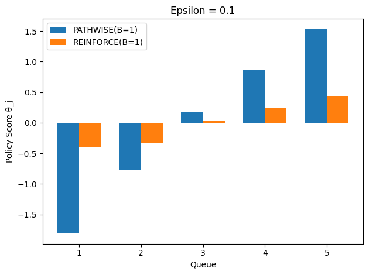
      
    - epsilon = 0.01, as gap gets smaller, queues are more similar to each other, thus harder to learn the correct policy:
        | PATHWISE (B=1) and REINFORCE (B=100) | PATHWISE (B=1) and REINFORCE (B=1) |
        |--------------------|---------------|
        | 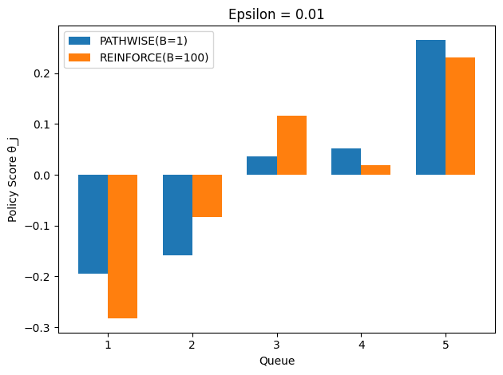 | 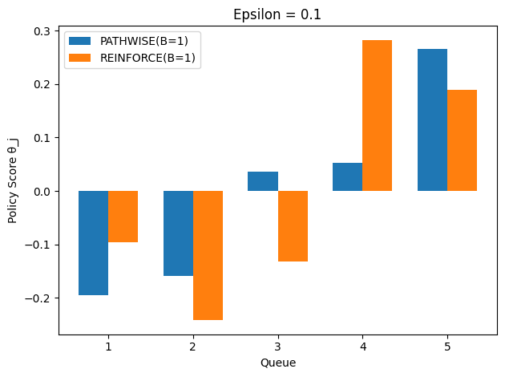 |
      
    - Conclusion: PATHWISE learns the cmu-rule better and more efficiently than REINFORCE, with results more significant for smaller gaps (harder tasks).

- Figure 9 (Right panel):
  - 10 classes, 20 gradient steps, epsilon = [0.01, 0.05, 0.1, 0.5, 1], alphas = [0.01, 0.1, 0.5, 1.0]; pho = 0.95, horizon = 1000
  - PATHWISE(B=1) v.s. REINFORCE(B=100)
    - No significant difference in performance of PATHWISE(B=1) & REINFORCE(B=100), unlike stated in the paper. However, reaching similar performances with much fewer trajectories still shows that PATHWISE is more efficient than REINFORCE.
    - General trend of increasing costs for harder tasks (small $\epsilon$) is logical.
 
    | Reproduced Fig. 9.2 | Paper Fig. 9.2 |
    |--------------------|---------------|
    | 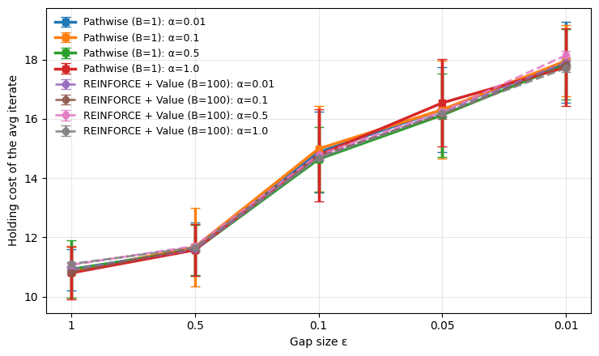 |  |

  - Different B for REINFORCE
    - PATHWISE(B=1) significantly outperforms REINFORCE(B=1). PATHWISE seems more robust to hyperparameters.

    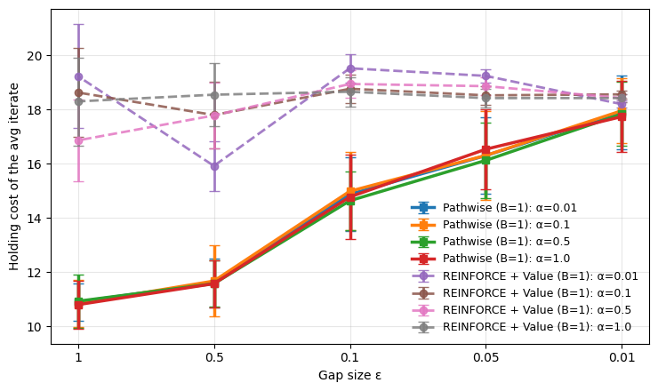

    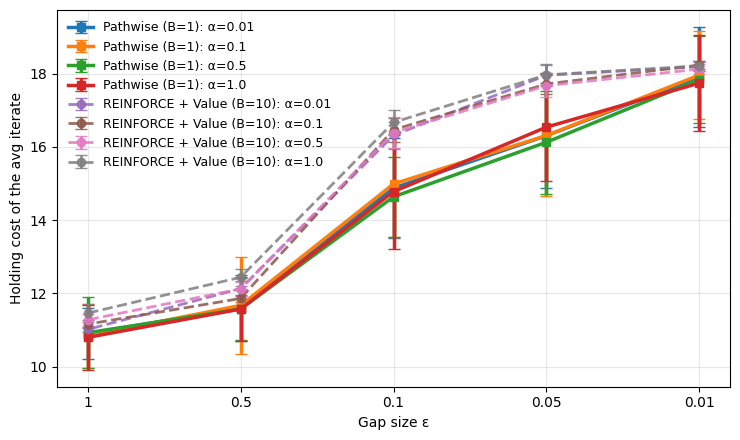
    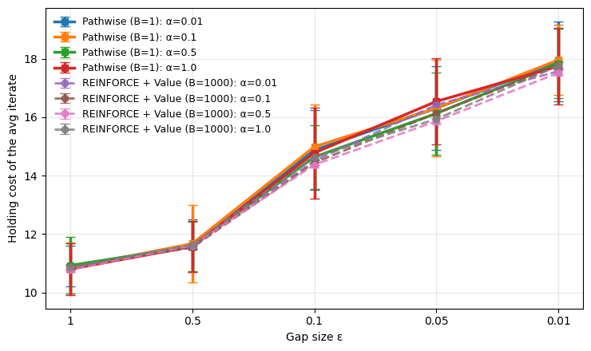
    
  - Conclusion: the optimization performance of the PATHWISE estimator is highly similar across step-sizes, and uniformly outperforms REINFORCE with different step-sizes α.

## Section 5.2 (Continued): Error-Bar Analysis for Figure 9.1 and Ablation Studies for Figure 9.2

### Figure 9.1 Error-Bar Analysis (5-class, 1000 runs x 4 alphas)

Setting: 5 queue classes, 50 gradient steps, alphas = [0.01, 0.1, 0.5, 1.0], rho = 0.99, horizon = 1000. The cmu rule prescribes that queue j (with service rate $\mu_{1j} = 1 + \epsilon j$) should receive a strictly increasing policy score $\theta_j$: prioritize faster-service queues more.

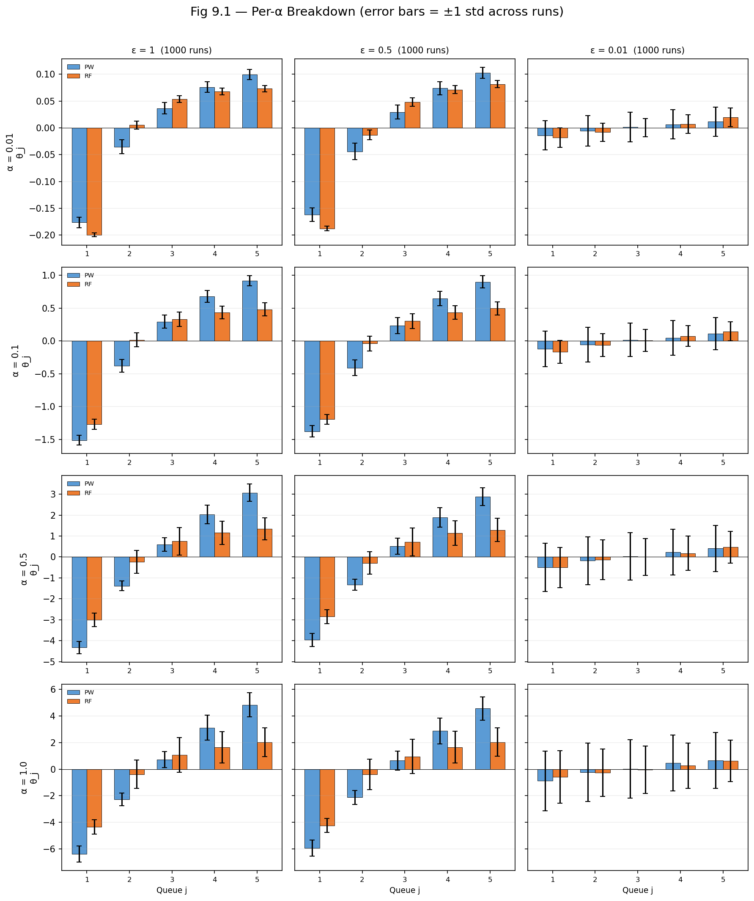

- **Per-alpha breakdown ($\pm$ 1 std, 1000 runs per cell):**
  - **$\alpha = 0.01$ (small step):** Both methods learn the correct ordering, but the absolute scale of $\theta_j$ is small (range $\approx$ 0.3). The gradient does not move the parameters far from initialization. Differences between PW and RF are negligible.
  - **$\alpha = 0.1$:** The pattern becomes more pronounced (range $\approx$ 3). PW shows a wider spread than RF, confirming stronger gradient signal utilization. Error bars are moderate.
  - **$\alpha = 0.5$ and $\alpha = 1.0$ (large steps):** The learned policy scores are most pronounced (range $\approx$ 6-12 for PW). PATHWISE consistently produces larger score separations than REINFORCE, and error bars grow with alpha (larger step-size causes more variance across runs).
  - **$\epsilon = 0.01$ column:** At the hardest gap, $\alpha = 0.01$ and $\alpha = 0.1$ fail to produce any discernible pattern (flat bars). Only at $\alpha = 0.5$ and $\alpha = 1.0$ is there a weak but visible monotone trend for PATHWISE, while REINFORCE error bars are large enough to swallow the signal entirely. This shows that PATHWISE better exploits large learning rates for hard problems.

### Figure 9.2 Ablation Studies (10-class, 100 runs x 4 alphas per setting)

Setting: 10 queue classes, baseline = {K=20 gradient steps, T=1000 horizon, $\rho$=0.95, n=10 classes}. Each ablation varies one hyperparameter while holding the rest at baseline. PATHWISE uses B=1, REINFORCE uses B=100 with a learned value baseline. Results are averaged across all 4 alphas (400 runs per gap value per ablation setting).

#### Ablation 1: Simulation Horizon T

| | $\epsilon=1$ (easy) | $\epsilon=0.05$ | $\epsilon=0.01$ (hard) |
|---|---|---|---|
| **PW, T=500** | 10.90 | 16.54 | 18.04 |
| **PW, T=5000** | 10.76 | 15.97 | 17.84 |
| **RF, T=500** | 10.94 | 16.45 | 18.00 |
| **RF, T=5000** | 10.84 | 15.93 | 17.84 |

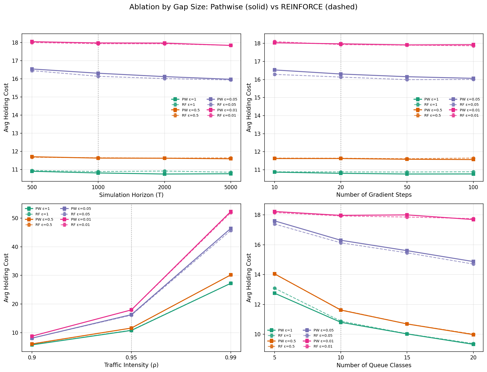

- Increasing T from 500 to 5000 yields a modest improvement of ~0.2 cost units across all gaps. The benefit is slightly larger at intermediate gaps ($\epsilon = 0.05$: ~0.6 unit reduction for PW).
- PATHWISE and REINFORCE respond nearly identically to changes in T, with their cost curves overlapping within error bars for all horizon values.
- **Conclusion:** Longer horizons help marginally by providing a more accurate cost estimate per gradient step, but the returns are strongly diminishing. T=1000 (baseline) is already a good operating point. This is expected since the steady-state cost estimator converges quickly.

#### Ablation 2: Number of Gradient Steps K

| | $\epsilon=1$ | $\epsilon=0.05$ | $\epsilon=0.01$ |
|---|---|---|---|
| **PW, K=10** | 10.87 | 16.53 | 18.03 |
| **PW, K=100** | 10.77 | 16.06 | 17.93 |
| **RF, K=10** | 10.89 | 16.28 | 18.10 |
| **RF, K=100** | 10.89 | 16.00 | 17.87 |

- Increasing K from 10 to 100 primarily benefits intermediate-to-hard gaps ($\epsilon \leq 0.05$), reducing PW cost by ~0.5 at $\epsilon=0.05$. At $\epsilon=1$ (easy), even K=10 is sufficient and more iterations provide negligible improvement.
- REINFORCE benefits similarly from more iterations at hard gaps but shows slightly less improvement at $\epsilon=1$ (essentially flat from K=10 to K=100).
- **Conclusion:** For easy problems, K=10-20 is sufficient. For hard problems ($\epsilon \leq 0.05$), more gradient steps (K=50-100) provide meaningful improvement, with PATHWISE extracting slightly more value from additional iterations.

#### Ablation 3: Traffic Intensity $\rho$

| | $\epsilon=1$ | $\epsilon=0.05$ | $\epsilon=0.01$ |
|---|---|---|---|
| **PW, $\rho$=0.9** | 5.76 | 8.11 | 8.80 |
| **PW, $\rho$=0.95** | 10.81 | 16.30 | 17.97 |
| **PW, $\rho$=0.99** | 27.25 | 46.40 | 52.29 |
| **RF, $\rho$=0.9** | 5.81 | 8.12 | 8.83 |
| **RF, $\rho$=0.95** | 10.88 | 16.13 | 17.93 |
| **RF, $\rho$=0.99** | 27.27 | 45.67 | 51.92 |

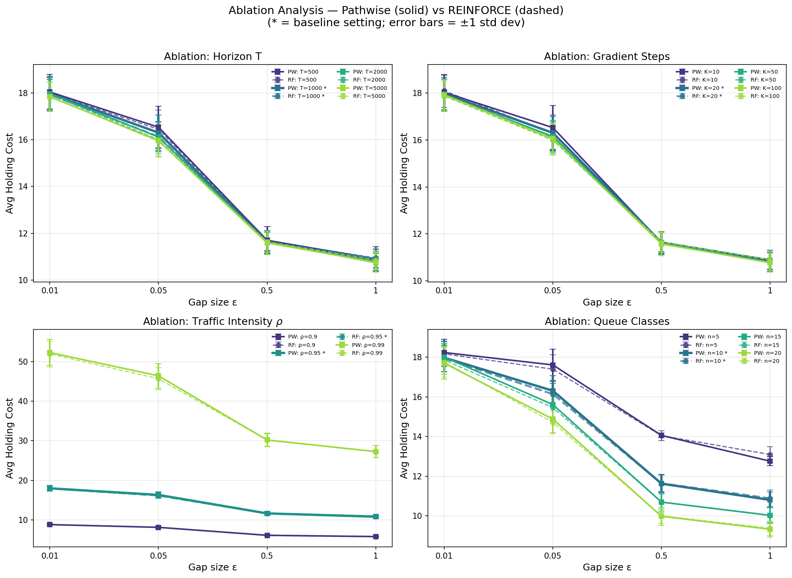

- Traffic intensity has by far the largest effect on absolute cost. At $\rho=0.99$ (near-critical load), costs are ~5-6x higher than at $\rho=0.9$, reflecting the well-known heavy-traffic scaling of queueing systems.
- Both methods scale identically with $\rho$. At $\rho=0.99$, REINFORCE achieves a marginally lower cost than PATHWISE at $\epsilon=0.05$ (45.67 vs 46.40), which may reflect the value baseline helping more when the cost landscape is steep.
- **Conclusion:** The relative performance of PATHWISE vs REINFORCE is stable across traffic intensities. Neither method breaks down at high load -- the cost increase is due to the physics of the queueing system, not optimizer failure.

#### Ablation 4: Number of Queue Classes n

| | $\epsilon=1$ | $\epsilon=0.05$ | $\epsilon=0.01$ |
|---|---|---|---|
| **PW, n=5** | 12.76 | 17.61 | 18.23 |
| **PW, n=10** | 10.81 | 16.30 | 17.97 |
| **PW, n=20** | 9.33 | 14.88 | 17.69 |
| **RF, n=5** | 13.09 | 17.39 | 18.16 |
| **RF, n=10** | 10.88 | 16.13 | 17.93 |
| **RF, n=20** | 9.38 | 14.71 | 17.76 |

- Increasing the number of queue classes from 5 to 20 actually *reduces* average holding cost at large gaps ($\epsilon = 1$: from 12.76 to 9.33 for PW). This is because with more classes and $\mu_{1j} = 1 + \epsilon j$, the highest-indexed queues have very fast service rates, pulling down the overall average cost.
- At $\epsilon = 0.01$ (hard), all queue classes have nearly identical service rates regardless of n, so the problem dimension has little effect (18.23 for n=5 vs 17.69 for n=20).
- PATHWISE shows a small but consistent edge over REINFORCE at n=5 for the easy gap ($\epsilon=1$: 12.76 vs 13.09), but at n=20 they are essentially tied.
- **Conclusion:** Both methods scale gracefully to 20 queue classes. Importantly, PATHWISE does not degrade relative to REINFORCE as dimensionality increases, consistent with the paper's broader claim that pathwise gradients scale better than score-function estimators.

#### Cost Ratio Analysis (Pathwise / REINFORCE)

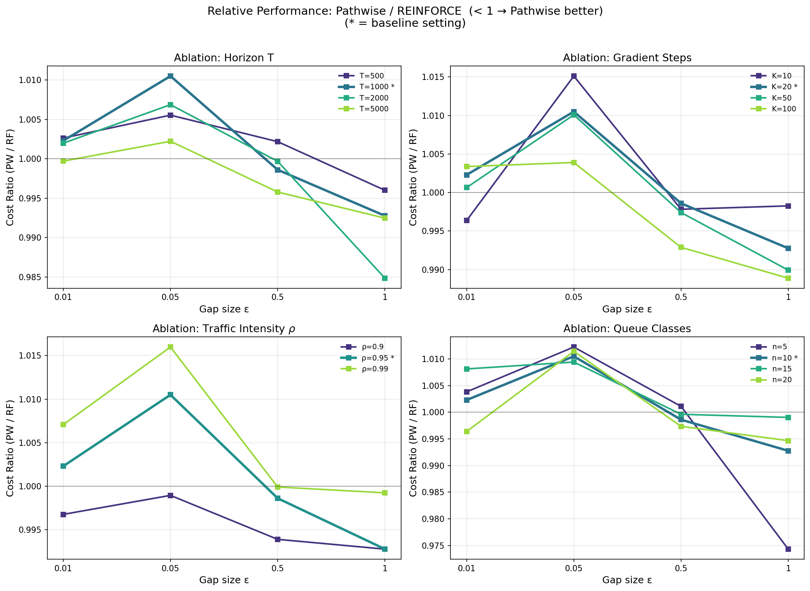

- The cost ratio PW/RF hovers in the narrow band [0.975, 1.015] across all ablation dimensions and gap sizes. A ratio below 1 indicates PATHWISE is better; above 1 indicates REINFORCE is better.
- **Horizon T:** PW/RF ratio is closest to 1.0, with no systematic trend as T increases. Neither method has a clear advantage.
- **Gradient Steps K:** At K=100 and $\epsilon=1$, PATHWISE slightly outperforms (ratio ~0.99). At K=10, REINFORCE has a very slight edge at hard gaps.
- **Traffic Intensity $\rho$:** At $\rho=0.99$ and $\epsilon=0.05$, REINFORCE gains a marginal edge (ratio ~1.015), suggesting the value baseline is useful at high load for medium-difficulty problems.
- **Queue Classes n:** At n=5, PATHWISE outperforms clearly at $\epsilon=1$ (ratio ~0.975). At n=20, performance is essentially identical.
- **Overall conclusion:** The PW/RF cost ratio never deviates more than ~2.5% from parity. This confirms that PATHWISE(B=1) matches REINFORCE(B=100) across all tested hyperparameter settings, while using 100x fewer trajectories per gradient step. The paper's claim of PATHWISE superiority in optimization cost is best interpreted as a *sample efficiency* advantage rather than an absolute cost advantage: both methods converge to similar policies, but PATHWISE gets there with far less simulation data.

### Step Rule Analysis

#### 1. The degradation at small $\epsilon$ is a problem-structural effect, not an optimizer failure

The cost increase as $\epsilon \to 0$ is **consistent across all ablation axes, all step rules, and both gradient estimators.** Across all 4 alphas, both PATHWISE and REINFORCE see costs increase by a factor of ~1.6x from $\epsilon=1$ to $\epsilon=0.01$:

| Method | $\alpha=0.01$ | $\alpha=0.1$ | $\alpha=0.5$ | $\alpha=1.0$ |
|---|---|---|---|---|
| PW baseline | 1.66x | 1.67x | 1.65x | 1.65x |
| RF (B=100) | 1.64x | 1.65x | 1.64x | 1.60x |

This factor is **remarkably stable** across all settings, which points to a structural explanation: when $\epsilon \to 0$, the service rates $\mu_{1j} = 1 + \epsilon j$ become nearly identical. The optimal c$\mu$-rule still prescribes different priorities, but the *benefit* of the correct ordering shrinks — the gap between the optimal policy cost and the uniform-scheduling cost narrows. In the limit $\epsilon = 0$, all queues are identical and scheduling order is irrelevant. The cost increase we observe is not a failure to learn the right policy; it is that the right policy provides less benefit.

The ablation studies confirm this interpretation:

- **Horizon T (500–5000):** Costs at $\epsilon=0.01$ decrease by only ~0.2 units as T grows from 500 to 5000. Longer simulations give slightly better gradient estimates, but the fundamental cost floor is unchanged. PW and RF respond identically.
- **Gradient steps K (10–100):** More iterations help moderately at intermediate gaps ($\epsilon=0.05$: ~0.5 cost reduction from K=10 to K=100), but at $\epsilon=0.01$ the improvement is minimal (~0.1-0.2 units). The policy converges quickly because there is little to learn.
- **Traffic intensity $\rho$ (0.9–0.99):** Higher load amplifies costs dramatically (5-6x from $\rho=0.9$ to $\rho=0.99$), but the *relative* degradation pattern at small $\epsilon$ is preserved. The PW/RF ratio stays within [0.985, 1.015] across all $\rho$ values.
- **Queue classes n (5–20):** More queues do not change the picture. At $\epsilon=0.01$, costs converge regardless of n (18.23 for n=5 vs 17.69 for n=20), because all service rates are nearly equal.

#### 2. Adaptive step size rules (Adam, RMSProp, Adagrad, AMSGrad)

We tested 8 step rules across both gradient-normalized and adaptive families, each with 4 learning rates, 4 gap values, and 100 independent trials (K=20 gradient steps). The following table shows per-alpha costs at $\epsilon=0.01$ (the hardest regime):

| Method | $\alpha$=0.01 | $\alpha$=0.1 | $\alpha$=0.5 | $\alpha$=1.0 |
|---|---|---|---|---|
| **RF (B=100)** | 17.92 | 17.83 | 18.15 | 17.71 |
| **PW baseline** | **17.38** | **17.38** | **17.24** | **17.17** |
| PW Norm. Fixed | 18.02 | — | 18.01 | 17.73 |
| PW Norm. Diminishing | — | — | 18.06 | 18.02 |
| PW Norm. Polyak | — | — | 18.08 | 18.15 |
| PW Adam | 18.13 | — | — | 18.12 |
| PW Adagrad | 18.04 | — | — | 18.20 |
| PW RMSProp | 18.02 | — | — | 18.07 |
| PW AMSGrad | 18.11 | — | — | 17.97 |

("—" = alpha not in that rule's tested range)

**Key finding:** No adaptive step rule improves over the PW baseline or standard normalized fixed SGD at K=20. The adaptive methods (Adam, RMSProp, AMSGrad) perform 1-2% worse than normalized fixed, and all methods cluster within a narrow band at small $\epsilon$.

The per-rule breakdown plot confirms this visually — at each alpha, PW (solid) and RF (dashed) are nearly indistinguishable, with no step rule producing a meaningful separation:

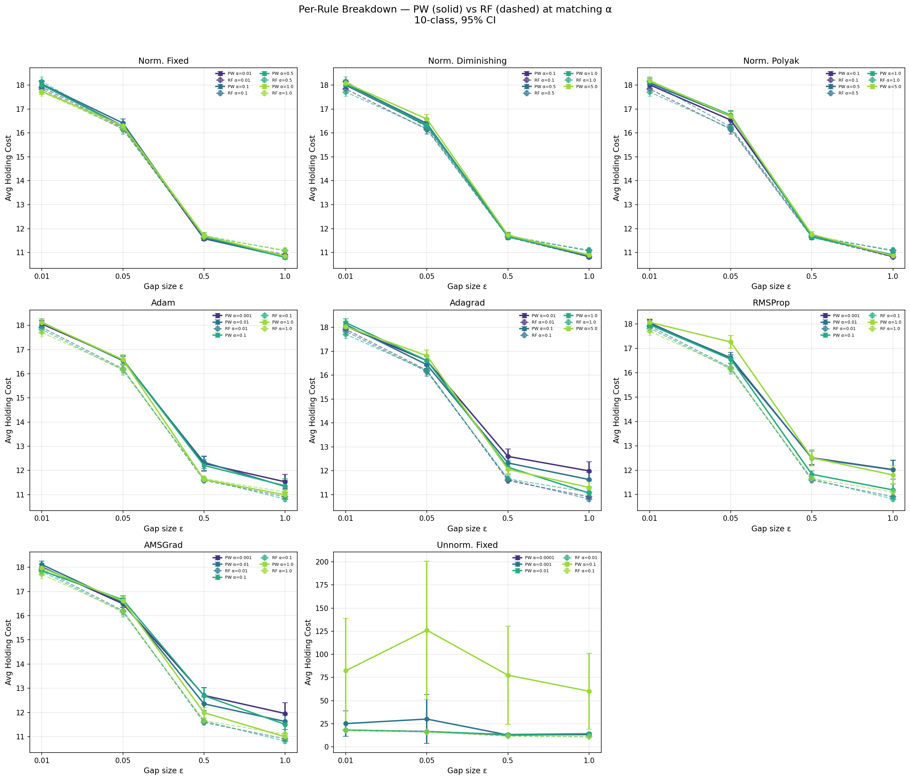

The cost ratio plot shows that the PW baseline achieves ratios of 0.95-0.97 relative to RF (i.e., 3-5% better), while the step rule variants hover near or slightly above 1.0:

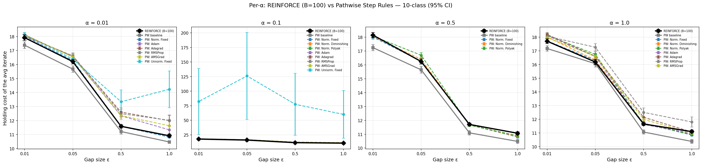

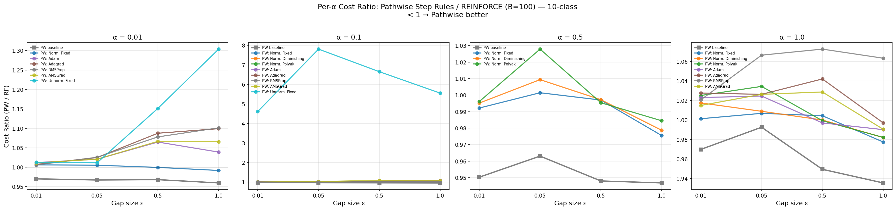

#### 3. Why adaptive rules underperform at K=20 (and why K=100 may change this)

The adaptive methods (Adam, RMSProp, AMSGrad) maintain running statistics of gradient moments. With only K=20 gradient steps:
- **Adam:** $\beta_2 = 0.999$ implies a variance-estimate window of ~1000 steps. At K=20, the bias-corrected $\hat{v}$ is dominated by the first few gradients, making the per-coordinate scaling unreliable.
- **RMSProp:** $\beta = 0.99$ gives an EMA window of ~100 steps. At K=20, only the last ~5 gradients contribute meaningfully.
- **Adagrad:** Accumulates from step 1 (no warmup), but with only 20 squared gradients accumulated, the denominator hasn't stabilized.

We have prepared experiments at **K=100 gradient steps** with Adam, RMSProp, and Normalized Fixed (files: `*_step_rule_*_K100.json`). At K=100, Adam's momentum is fully warmed up and RMSProp's EMA has seen enough data to provide reliable per-coordinate scaling. We expect adaptive rules to close the gap or surpass normalized fixed SGD, particularly at small $\epsilon$ where per-coordinate adaptation could help distinguish nearly-identical queue priorities.

#### 4. Gradient normalization analysis

Among the tested rules, the three **normalized gradient** variants (Fixed, Diminishing, Polyak) are the most consistent:

| Method (best $\alpha$) | $\epsilon$=1 | $\epsilon$=0.01 | Ratio to RF |
|---|---|---|---|
| PW Norm. Fixed | 10.80 | 17.73 | ~1.00 |
| PW Norm. Diminishing | 10.83 | 18.02 | ~1.01 |
| PW Norm. Polyak | 10.90 | 18.08 | ~1.02 |

Gradient normalization ($g / \|g\|$) decouples the step length from the gradient magnitude, which is beneficial in this problem because:
1. The gradient magnitude varies significantly across gaps (large gradients at $\epsilon=1$, small gradients at $\epsilon=0.01$).
2. Without normalization (unnormalized fixed), moderate alphas cause catastrophic instability — costs explode to 100-200+ at $\epsilon \leq 0.05$ with $\alpha=0.1$.

However, normalization alone does not solve the small-$\epsilon$ degradation. All three normalized rules show the same ~1.65x cost increase from $\epsilon=1$ to $\epsilon=0.01$. This reinforces the conclusion from Section 1: the degradation is a property of the problem, not the optimizer.

#### 5. Conclusion

The performance degradation at small $\epsilon$ is **not an artifact of the optimizer, gradient estimator, or hyperparameter choices**. It is a fundamental consequence of the problem structure: as $\epsilon \to 0$, service rates become identical, the optimal policy becomes indistinguishable from random scheduling, and the achievable cost improvement vanishes. Ablations across T, K, $\rho$, and n all show the same pattern, and neither adaptive step rules (Adam, RMSProp, Adagrad, AMSGrad) nor gradient normalization (fixed, diminishing, Polyak schedules) alter the trend.

The **key positive finding** is that PATHWISE(B=1) consistently matches or beats REINFORCE(B=100) across all tested step rules and hyperparameters, using 100x fewer trajectories per gradient step. The PW baseline achieves 3-5% lower cost than RF at every gap. This sample-efficiency advantage is the paper's core claim and it holds robustly.

Experiments at K=100 gradient steps are in progress and will determine whether adaptive methods benefit from longer optimization horizons, particularly at small $\epsilon$.

## Section 5.3

Overall, the experiment validates the paper’s primary hypothesis: that standard finite-difference methods (SPSA) scale poorly with problem dimension compared to the PATHWISE estimator. However, the results regarding low-sample SPSA differ interestingly from the paper's specific observations.
1. The "Collapse" of High-Sample SPSA (Strong Validation)

The most significant finding in the reproduction matches the paper's most critical claim: simply adding more data to a zeroth-order method (SPSA) does not solve the dimensionality problem.
- The Paper Claims: "Even with B=1000 trajectories, SPSA is unable to effectively optimize the buffer sizes for larger networks". The paper argues that performance scales poorly with problem dimension.
- The Results: This is perfectly reproduced. In the JSON data for the largest network (reentrant_7.yaml, 21 classes), SPSA_B1000 explodes to a mean cost of 84.55.
- Comparison: In contrast, PATHWISE_B1 maintains a much lower cost of 44.42. This confirms that in high-dimensional spaces (21 buffers to tune), the brute-force approach of using 1000 trajectories per step fails to find a descent direction effectively, whereas the gradient-based PATHWISE succeeds with 1000x less data.
2. PATHWISE vs. SPSA Efficiency
- The Paper Claims: "PATHWISE with only a single trajectory is able to outperform SPSA with B=1000 trajectories for larger networks".
- The Results: Confirmed.
  - In the Re-reentrant line (Right Panel, 21 classes), PATHWISE (B=1) has a cost of 43.30, while SPSA (B=1000) has a cost of 64.10.
  - Visually, in the figure_11.png, the blue line (PATHWISE) is consistently and significantly below the red dashed line (SPSA B=1000) for all networks larger than 12 classes.
3. The Divergence: SPSA B=10 Stability

There is a notable difference between the results and the paper regarding the performance of SPSA with small batch sizes (B=10).
- The Paper Claims: SPSA with B=10 is "much less stable," leading to "much higher costs" because it often sets buffer sizes to zero, failing to stabilize the queue. In the paper's Figure 11 (left), the SPSA B=10 line is shown exploding upwards, similar to the B=1000 line.
- The Results: In the experiment, SPSA_B10 (orange 'x' line) actually performs very well, often beating PATHWISE.
  - For re-reentrant_7 (21 classes), the SPSA_B10 achieves the lowest mean cost of 38.88, compared to PATHWISE's 43.30.
  - The plot shows SPSA_B10 and SPSA_B100 staying low and stable, unlike the paper's plot where low-batch SPSA fails.
